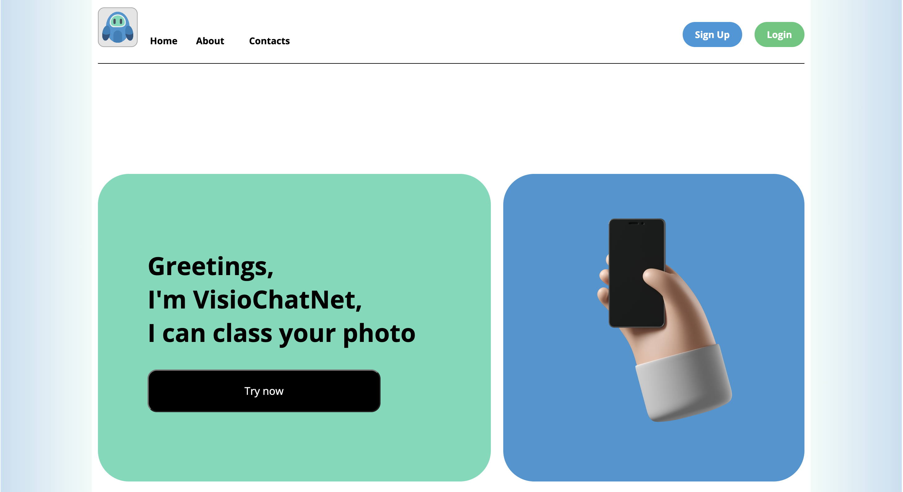

# Visiochatnet

Welcome to Visiochatnet – an innovative chat application created by our team. Built on the robust Flask framework, our application offers a suite of features designed to enhance user interaction, including seamless user registration, advanced chat management, secure email verification, and efficient caching mechanisms. Dive into the future of chat applications with Visiochatnet, where connectivity meets convenience.

## Features at a Glance

- **User Registration**: Easy and secure sign-up process with email verification to get you started in no time.
- **Chat Management**: Sophisticated chat management system allowing for private conversations with bot and chat history.
- **Email Verification**: Enhanced security through a robust email verification system to prevent unauthorized access.
- **Caching**: Speed up your chat experience with our efficient caching system, reducing load times and improving performance.

## Technical Highlights

Our team has pushed the boundaries of machine learning by training a neural network on the CIFAR-10 dataset, achieving an impressive accuracy of 93.01% on validation data. This advanced model plays a crucial role in optimizing chat functionalities and providing users with a seamless experience.

### Model Accuracy Analysis

Below are charts showcasing the meticulous training process and the high accuracy levels our model has achieved:


For an in-depth look at our model's training logs and detailed reports, explore the `src/ai/` directory.

## Getting Started

Ready to dive into Visiochatnet? Here’s how you can get the application up and running on your local machine or server:

### Prerequisites

Ensure you have Docker installed on your system to simplify the setup process. Visit [Docker's official site](https://www.docker.com/get-started) for installation instructions.

### Installation

1. Clone the Visiochatnet repository:
   ```
   git clone https://github.com/Adentas/visiochatnet.git
   ```
2. Navigate to the project directory:
   ```
   cd visiochatnet
   ```
3. Run the Docker container:
   ```
   docker-compose up --build
   ```

After completing these steps, Visiochatnet will be running on your local server. Visit [http://localhost:5000](http://localhost:5000) to start chatting!

## Docker Hub

For ease of use and deployment, Visiochatnet is also available on Docker Hub. Access our Docker container [here](https://hub.docker.com/repository/docker/leegosq/visiochatnet-web/general).

## Our Application in Action

Take a look at the interface of our application:



To access and use the application, click [here](https://visiochatnet.fly.dev/).

## Contact Us

For questions, suggestions, or just to say hi, reach out to our team:

- Illya Hryhoriev [Team Leader] - [GitHub](https://github.com/Adentas)
- Dmytro Paukov [Scrum Master] - [GitHub](https://github.com/paukdv)
- Dmytro Klymenko [Developer] - [GitHub](https://github.com/leegosx)
- Dmytro Filin [Developer] - [GitHub](https://github.com/UkrainianEagleOwl)

Join us in shaping the future of chat applications with Visiochatnet!
